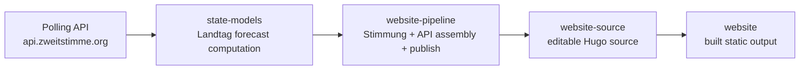

# State Election Models

R + Stan (`rstanarm`) forecasts for German **Landtag** elections, used on [zweitstimme.org](https://zweitstimme.org). Daily runs live in [website-pipeline](https://github.com/zweitstimme-org/website-pipeline).

Each forecast is **4,000** posterior simulations: `stan_glm(..., chains = 4, iter = 2000)` (default half warmup → 4 × 1,000 saved draws). `posterior_predict()` then produces one vote-share vector per draw; those 4,000 rows are the “Simulationen” on the website (point estimate = median, 5/6-interval = quantiles, scenario probabilities = share of draws).

## Role in the stack

This repo is the **state forecast computation** layer, not the website itself.



## Repository boundary

- **`state-models`** computes Landtag forecasts and posterior draws
- **`website-pipeline`** runs Stimmung, assembles `/api/...`, and publishes to preview/live
- **`website-source`** is the editable Hugo source used to build the live site
- **`website`** is the compiled static output served by GitHub Pages

Architecturally this repo is the source of truth for the **forecast computation itself**. Website JSON, API files, and deploys are not produced here.

## Deployment

Production Landtag forecasts are **not** deployed from this repo. The GitHub Action under `.github/workflows/` is disabled.

The daily/manual run lives in [website-pipeline](https://github.com/zweitstimme-org/website-pipeline): it clones this repo, runs `run_pipeline.R` (or the skip-estimate path), converts `fcst_state.Rdata` to `forecast_state_*.json` / draws JSON, then publishes into `website-source` → `website`.

By default that pipeline should skip a rerun when no newer poll exists than the already published `last_poll_date` (override with `force_refresh=true` on the workflow).

Generated files (`data/output/`, fitted RDS, figures) stay out of git. Rebuild them locally; live site JSON comes from website-pipeline.

## Run

From the repo root (needs R 4.4+, `rstanarm`, and packages in `code/auxilary/packages.R`):

```bash
# Polls from https://api.zweitstimme.org (override with POLLING_API_BASE)
Rscript run_pipeline.R          # data → estimate → forecast
# or
Rscript run_everything.R        # same, plus evaluation figures
```

Hand-maintained inputs (update when governments or historical results change):

- `data/input/01_state-election-results.csv`
- `data/input/02_state-cabinets.csv`
- `data/input/03_federal-election-results.csv`

Generated files (`data/output/`, fitted RDS, figures) are **not** in git. Rebuild them locally. Live JSON for the site is published by website-pipeline (`forecast_state_*.json`), not from this repo.

Optional: `ELECTIONS_TO_FORECAST=st_2026-09-06,be_2026-09-20,mv_2026-09-20` and `MODEL_POLLS_ONLY=1` (default in the website pipeline: polls-only, exact lead days).

## Layout

- **code/** — numbered scripts (`01_build_data.R` … `07_figures_forecast.R`) plus `auxilary/`
- **data/input/** — election results and cabinet flags
- **docs/forecast-bw-rp-2026/** — BW/RP 2026 methodology note
- **run_pipeline.R** / **run_everything.R** — entry points

## Contact

**Cornelius Erfort**  
University of Witten/Herdecke  
[cornelius.erfort@uni-wh.de](mailto:cornelius.erfort@uni-wh.de)  
[ORCID: 0000-0001-8534-7748](https://orcid.org/0000-0001-8534-7748)
